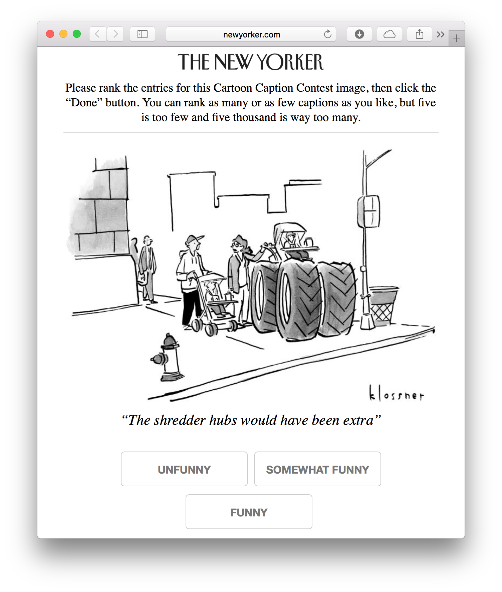

This repository contains data gathered on the 
[NEXT active machine learning system] 
for the New Yorker caption contest. The user sees a similar question to
the one below and we provide information to the below questions/the answer/etc:

| New Yorker hosting                       | "How funny is this caption?"            | "Which caption is funnier?"            |
| :-----:                                  | :------:                                | :-----:                                |
|  |  |  |
| Cardinal bandits                         | Cardinal bandits                        | Dueling bandits                        |


After publishing 571 on 2016-06-04, we provide

* about **2.2 million** responses to 18 different caption contests that include
  passive and possibly adaptive algorithms. These can be founds in
  `contests/{passive, passive+adaptive}`.
* about **18.4 million** responses to 43 different contests in
  `contests/adaptive-only contests`. These only use one adaptive algorithm.
* ratings on over **363,000** different captions

For each response, we record

* information on the user (participant ID, response time, timestamp, network
  delay, etc)
* information on the question (caption(s) present, user answer, algorithm
  generating query)

*The data for an individual experiment is in the [`contests/`] directory.* For
example, caption contest 505 lives in [`contests/random+adaptive/505/`]. More
description and detail is given in the individual folder.

[`adaptive-only-contests`]:adaptive-only-contests/
[`contests/`]:contests/
[`contests/random+adaptive/505/`]:contests/random+adaptive/505

## Dataset high-level description
These datasets are part of the "cartoon caption contest" where given a cartoon
users are supposed to write a funny caption. Our algorithms help determine the
funniest algorithms (and we also provide *unbiased* data).

We ask users to rate caption funniness in some way (more detail is provided in
each folder). This could be questions like "Is the funnier caption on the left
or right?" or "How funny is this comic -- 'unfunny', 'somewhat funny' or
'funny'?"

More detail is given in each folder. Each folder's name corresponds to
which caption contest it appeared in.

## Data provided
We provide response data for each user. We provide the details on what each
query consists of as well as their answer/other information.

We provide

* simplified response data as a CSV with header described below
* full response data as a JSON object. This file is parsed by
  `get_responses_from_next/json_parse.py`
* all possible captions
* the cartoon the captions were being written for

### Response data, CSV headers
* **Partipipant ID:** The ID assigned to each participant. Note this is
  assigned when the page is visited; if the same user visits the page twice,
  they will get two participant IDs.
* **Response Time (s):** How long the participant took to respond to the
  question. Network delay is accounted for
* **Network delay (s):** How long the question took to load.
* **Timestamp:** When the query was generated (and not when the query was
  answered)
* **Alg label:** The algorithm responsible for showing the query. The random
  sampling is unbiased while "Lil_UCB" adaptively chooses the funniest caption.

#### Dueling bandits headers
Queries of the form "which caption is funnier?"

* **Left** and **Right** (both headers appear): The caption that appeared on the left/right.
* **Answer**: What the user selected as the funnier caption.

#### Cardinal bandits headers
Queries of the form "how funny is this caption?"

* **Target:** The caption the user is asked to rate.
* **Rating:** What the user rated the caption as. This can be either 1, 2 or 3
  depending on if the joke was unfunny, somewhat funny or funny respectively.

## data.world
This data is available on [data.world] as [stsievert/caption-contest-data]. To
obtain this data, follow their [install instructions] then run

[stsievert/caption-contest-data]:https://data.world/stsievert/caption-contest-data

``` python
>>> import datadotworld as dw
>>> d = dw.DataDotWorld()
>>> data = d.load_dataset('stsievert/caption-contest-data')
>>> print(data.tables['orginal/546_summary_LilUCB.csv'][0])
... OrderedDict([('', '0'),
                 ('rank', '1'),
                 ('caption', 'We never should have applauded.'),
                 ('score', '1.8421052631578947'),
                 ('precision', '0.04554460512094434'),
                 ('count', '285.0'),
                 ('unfunny', '110.0'),
                 ('somewhat_funny', '110.0'),
                 ('funny', '65.0')])
```

[data.world]:https://data.world
[install instructions]:https://github.com/datadotworld/data.world-py

### Datasets provided
* trimmed participant responses, as a CSV (headers included above)
* a trimmed CSV for each collection scheme, as detailed below.
* the full participant response data as a `.json` file. The files to parse this
  file are included in this repo (`json_parse.py`).

### Collection schemes
We decided to generate queries in several ways, either *adaptively* or
randomly. The random data makes no choices based on previous responses on which
queries to ask. The adaptive method does make choices based on previous
responses to decide which queries to ask.

We consider the randomly collected data to be unbiased and the adaptively
collected data to be biased. The randomly collected data is collected under the
"RandomSampling" and "RoundRobin" algorithms while the adaptive schemes are
with the "LilUCB" algorithm.

[499]:contests/499/
[497]:contests/497/
[505]:contests/505/
[507]:contests/507/
[New Yorker Caption Contest]:http://contest.newyorker.com
[Cartoon Lounge: Show Me the Funny]:http://www.newyorker.com/cartoons/bob-mankoff/cartoon-lounge-show-me-the-funny

## Example queries
In earlier experiments, sample queries are also shown (minus 509). Other experiments have specified that the experiment setup being
run was either "Cardinal" or "Dueling". In these two experiments, example
captions are below:

The user is given a URL and after visiting the URL, the user is presented with
a series of queries similar to the one above. There may be variations on the
query, described in detail on each experiment.

[NEXT]:http://nextml.org/
[NEXT active machine learning system]:http://nextml.org/
