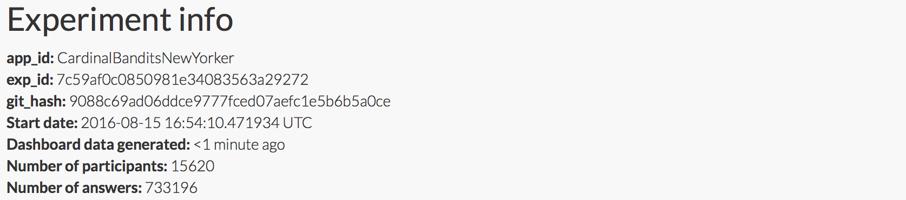

Experiment info:

Cardinal bandits (aka "how funny is this caption?")

Histogram of when people responded.

This experiment required reloading the page after each answer. However, the
time required to reload was much reduced as the New Yorker is now embedding our
query page (this is new in contest 532).

This experiment was launched with the New Yorker and hosted on their page.

