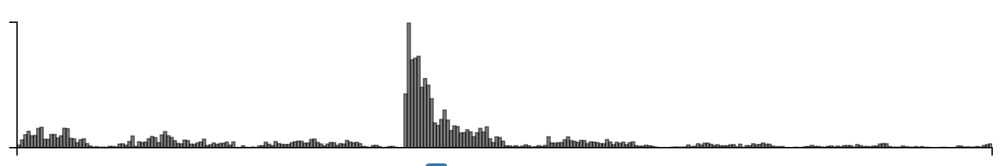
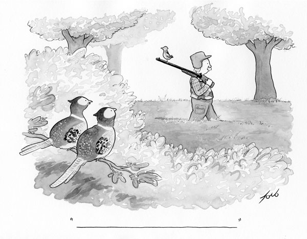

Experiment info:

Cardinal bandits (aka "how funny is this caption?")

Histogram of when people responded.

I didn't forgot to grad a screenshot of the cartoon embedded in the query
page. It is similar to 518's query page, but with this comic:

This experiment required reloading the page after each answer.

This experiment was launched with the New Yorker and hosted on their page.
