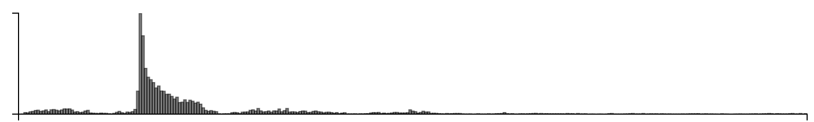
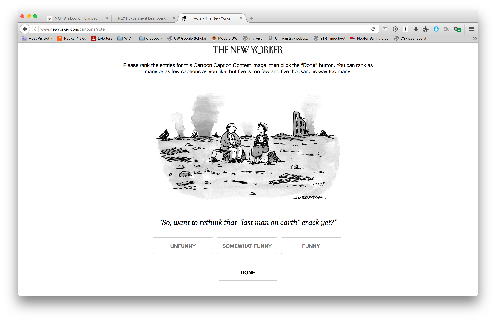

Cardinal bandits (aka "how funny is this caption?")

Histogram of when people responded:

Example query:

This caption contest was also live on the New Yorker caption contest page
(reloading, ads).

This week, for all captions that had at least one duplicate caption, I included a single, exact duplicate of the original caption for comparison purposes. These duplicate captions are listed below:

> * Do you come here often?
> * Not even if I'm the last man on earth?
> * Don't blame me. I voted for Her
> * Gesundheit.
> * There goes the neighborhood.
> * What's for dinner?
> * Yea, but think of all the construction jobs he just created!
> * But her e-mails...
> * But what about her emails?!!
> * But I am the last man on earth.
> * I told you so.
> * I told you I smelled gas.
> * I want to see other people.
> * I suppose this is my fault, too.
> * Okay, maybe I should have read the instructions.
> * It's not you. It's me.
> * Trumpageddon.
> * And how does this make you feel?
> * Should we go out for dinner?
> * So...what do you like to do for fun?
> * You voted for him.
> * Well... now I am the last man on earth
> * Don't blame me. YOU voted for him.
> * I don't think the bus is coming.
> * So, is America Great Again yet?
> * Make America Great Again.
> * Don't blame me. I voted for Hillary.
> * Your place or mine?
> * We'll always have Paris...
> * Are we Great Again yet?
> * What's your sign?
> * 'Nothing much. What's new with you?'
> * Hey, I didn't vote for him!
> * I think we should see other people.
> * Well, we still have each other.
> * So much for make america great again.
> * So what if I WAS the last man on earth?
> * I told you not to vote for Trump.
> * Our relationship is in ruins.
> * Now will you marry me?
> * well, there goes the neighborhood.
> * So.... how was your day?
> * Frankly my dear I don't give a damn
> * Wellchat didn't take long
> * So .... what's new?
> * Did you hear something?
> * At least we have each other.
> * Yeah, but what about her emails?
> * So, now that I AM the last man on Earth...
> * You said "If you was the last man on Earth"...
> * Come here often?
> * I thought YOU turned off the stove.
> * Ah. alone at last!
> * So, maybe I shouldn't have voted for Trump.
> * That was one hell of an inauguration
> * I guess elections do have consequences.
> * "Will you bury me"?
> * No wonder we could get tickets.
> * So now, will you go out with me?
> * This is what happens when you start nagging me women.
> * I knew we shouldn't have voted for Trump.
> * Wanna fool around?
> * Excuse me.
> * "Open space remodel," she said.
> * How is this is my fault?
> * America's great again.
> * Fake news!
> * Eve?
> * Now, where were we?
> * And if I WAS the last man on earth?
> * Are you feeling the Bern now.
> * So much for our reverse mortgage.
> * Well, at least we've got each other.
> * Well, you voted for him!
> * I told you not to vote for him.
> * I am the last man on earth.
> * You're hired.
> * Life is like a box of chocolates......
> * As I was saying before we were so rudely interrupted...
> * Trump.
> * Elections have consequences.
> * Is this what he meant by "Making America great again?"
> * Yeah but her emails.
> * Funny how life inmates our marriage.
> * So, about that 'last man on Earth' thing ...
> * But those emails...
> * You didn't have to blow up like that!
> * You were saying?
> * So, where shall we go for dinner?
> * ...And that's all I had to say about that.
> * I'm gay.
> * Don't look at me. I voted for Hillary.
> * I'd like to see other people.
> * Don't look at me, you voted for him.
> * Hillary would've been worse.
> * ... and it's only January 21st.
> * But what about those e-mails?
> * Even if I were the last man on Earth?
> * You win.
> * Did you turn off the stove?
> * Mistakes were made.
> * I never promised you a rose garden.
> * Homes explode sometime, it's got nothing to with your mother coming to visit.
> * Told ya.
> * Okay, you can have the house.
> * Mind if I smoke?
> * Do you live around here?
> * Sad!
> * So? You from around here?
> * I told you it was a bad idea to vote for Trump
> * What is Aleppo?
> * Not even if you were the last man on earth...
> * A penny for your thoughts.
> * Was it something I said?
> * Don't look at me ; I didn't vote for him.
> * Not if you were the last man on earth.
> * Happy now?
> * So, where are you from?
> * But emails!
> * So, how about now?
> * I told you not to touch the remote.
> * Okay. You were right.
> * Sure, but what about her emails?
> * Have you seen my glasses?
> * So... what's for dinner.
> * Don't blame me. I didn't vote for him.
> * You were right. I shouldn't have voted for him.
> * At least he drained the swamp...
> * Don't blame me, I voted for Jill Stein.
> * Did I leave the stove on?
> * I told you, we should have voted for Hillary!
> * It's not like it's the end of the world.
> * Let's eat out tonight.
> * Gee, I voted for Trump, too.
> * I can't remember if I closed the garage door.
> * And to think it all started with a tweet....
> * As I was saying....
> * I think I left the iron on.
> * I blame the media
> * So, what's for lunch?
> * So NOW you want to talk?
> * No, YOU blinked!
> * So will you go out with me NOW?
> * Satisfied?
> * Now, what do we do?
> * At least he didn't use a private e-mail server.
> * I told you I couldn't cook
> * Well, it was, "huuuge."
> * And who did you vote for?
> * Don't look at me, I didn't vote for Trump.
> * Less is more.
> * Well, I heard from some very reliable sources that a brand new affordable medical plan will be offered in only two more days.
> * I still say, lock her up!
> * Did you remember to lock the door?
> * I think now is the time to buy.
> * Let's start over.
> * Thanks Obama!
> * It thought you left the stove on.
> * Emails
> * What do you mean "if" I was the last man on Earth?
> * Wasn't me.
> * At least we got rid of Obamacare.
> * January 20, 2018
> * Did you leave the stove on again?
> * It's all Obama's fault.
> * Have you seen my "Make America great again" hat?
> * Well, at least we have our health.
> * Great
> * I guess it's up to us, Eve.
> * Well that escalated quickly.
> * We've been Trumped!
> * That was a close one
> * So you're the last woman on earth.
> * It's not the end of the world.
> * So, what else is new?
> * At least they repealed Obamacare.
> * I'm tired of winning.
> * I miss the old neighborhood.
> * I still say we should give him a chance.
> * Now what?
> * Where would you like to go for dinner?
> * OK, I admit I voted for him.
> * You voted for him, not me.
> * Love is a battlefield.
> * Our marriage is in ruins.
> * I told you it wouldn't work
> * I told you I thought I smelled gas.
> * I love what you've done with the space.
> * He won.
> * I told you not to deep fry the turkey.
> * My ex-place or yours?
> * This is why we can't have nice things.
> * We should have voted for Hillary.
> * Wanna have sex?
> * Madam, I'm Adam
> * You started it.
> * Should we get take-out?
> * So...Who did you vote for?
> * I want a divorce.
> * But he promised to make America great again.
> * I still say 2016 was worse.
> * So, you left the stove on?
> * Well, that’s one way to drain the swamp.
> * I'm still not sleeping with you.
> * Coffee?
> * Still better than Hillary.
> * what'd I say?
> * Where have all the flowers gone?
> * So, is this your first apocalypse?
> * I told you to turn off the stove
> * Yeah, but Hillary's emails.
> * I told you that cat was trouble.
> * The people have spoken.
> * Well, at least he got rid of Obamacare!
> * It could have been worse
> * So, about that "last man on earth" comment!
> * Hey, I didn't vote for him either.
> * Do you smell gas?
> * So what do you want to do now?
> * We have to start meeting like this..
> * You're the one who voted for him.
> * Maybe we should have voted.
> * Still glad you voted for Trump?
> * I still want a divorce,
> * At least we still have eachother
> * We need to talk
> * So...are you single?
> * I dunno. What do you want to do?
> * O K you win.
> * Did we leave the oven on?
> * I told you we should have moved to Canada!
> * I told you this would happen.
> * I voted for Jill Stein.
> * How was traffic?
> * That was close.
> * Maybe we shouldn't have voted for Trump.
> * What?
> * Don't blame me, I voted for Bernie.
> * But SHE used a private email server!
> * So, how are the kids?
> * No, I did not leave the gas on.
> * So much for the first 100 days!
> * He won. She lost. Get over it.
> * I blame the Russians.
