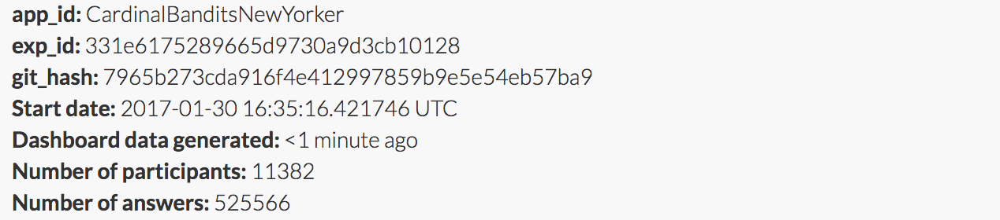
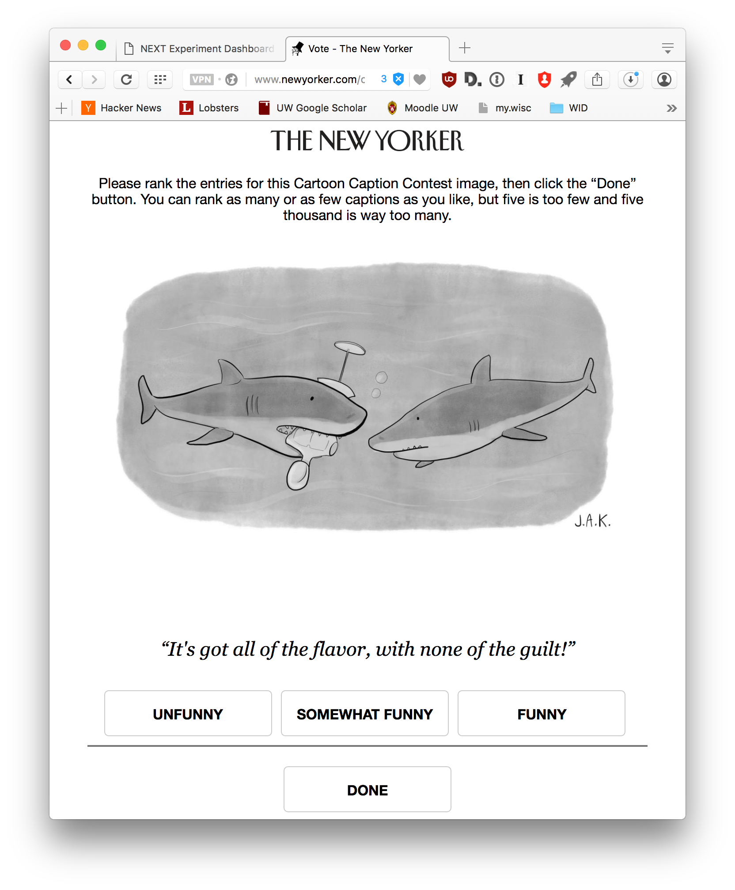

Cardinal bandits (aka "how funny is this caption?")

Histogram of when people responded:

Example query:

This caption contest was also live on the New Yorker caption contest page
(reloading, ads).

> This week, for all captions that had at least one duplicate caption, I included a single, exact duplicate of the original caption for comparison purposes. These duplicate captions are listed below:

> * I'm on a diet.
> * I'm on a high fiber diet.
> * I'm a vegan.
> * I saw it in the window and I just had to have it.
> * Tastes like chicken!
> * I've decided to go Vegan.
> * I'm trying to quit
> * It was on sale.
> * I've gone vegan.
> * I'm dieting.
> * The doctor says I need more fiber in my diet.
> * It's gluten-free
> * It just needs dressing.
> * I won the mannequin challenge.
> * It's an acquired taste.
> * I'm trying to get more fiber in my diet.
> * I can't believe it's not human
> * I don't think that's how the mannequin challenge works...
> * I'm on a low-fat diet.
> * Just practicing.
> * Project Runway meets Shark Tank.
> * It helps with the cravings
> * You had one job!
> * Man eating not mannequin!
> * Practice makes perfect.
> * That's not how you do the mannequin challenge.
> * Hey, Dummy!
> * I'm trying to cut back.
> * Does this make me look fat?
> * Who are you calling a dummy?
> * I'm going vegan
> * It tastes just like a rubber chicken!
> * Tastes great, less filling.
> * I thought they said "man" overboard.
> * I’ve become a vegan.
> * It needs salt.
> * I can't believe it's not boater!
> * alternative snacks
> * I'm a vegan now.
> * Needs dressing.
> * Gluten free!
> * It's an alternative human.
> * It's not what it looks like!
> * Who's the dummy now?
> * Retail is dead.
> * If anyone asks just say it's delicious and so much better than what the dolphins are having...
> * Atkins.
> * Do I have something in my teeth?
> * mannequin challenge?
> * That's not what they mean by the Mannequin Challenge.
> * It doesn't taste like chicken.
> * I'm going gluten-free.
> * It came pre-limbed.
> * You're fired!
> * I hate Fashion Week.
> * When did you go vegan?
> * Tastes just like chicken.
> * Dummy.
> * That's not how the Mannequin Challenge works.
> * Who you calling dummy?
> * GMO?
> * It's a dummy, you dummy.
> * Tastes a little gamy.
> * I'm in training.
> * It looked better than it tastes.
> * Tastes like chicken. Of the sea.
> * It's my cheat day.
> * "Vegan".
> * Its a dummy, dummy.
> * I'm a vegetarian.
> * What? It's gluten free.
> * I said manaTEE
> * Practice, practice, practice.
> * You're going to need a bigger coat.
> * Pardon me, do you have any Grey Poupon?
> * I'm a strict vegan!
> * It's all that was left.
> * I needed more fiber in my diet.
> * I'm doing the mannequin challenge.
> * Alternative foods.
> * You're right, not much nutritional value. But nice crunch.
> * ...and it's gluten free.
> * It's an 'alternative snack.'
> * Don't worry. It's armless.
> * Its an alternate meal
> * Dad, that's not how you do the mannequin challenge.
> * It's "alternative" food.
> * Did I win the mannequin challenge?
> * Leftovers again?
> * Who's the dummy?
> * The patch didn't work for me.
> * Mannequins are friends, not food.
> * It tastes fishy
> * It looked better on the shore.
> * Me, I prefer organic.
> * My doctor said I need more fiber in my diet.
> * I'm an alternative man-eater.
> * I saw it in the window and I couldn't resist
> * It's a practice dummy.
> * It's alternative prey.
> * Alternative human!
> * Less calories.
> * It's called the mannequin challenge.
> * Sometimes, ya just feel like a dummy.
> * It was love at first bite.
> * I thought you said it tasted like chicken?
> * I hate Meatless Monday.
> * Do I have anything on my teeth?
> * Don't judge me!
> * #fakechews
> * More fiber, fewer calories.
> * You should have seen the one that got away!
> * But it is gluten free
> * Empty calories
> * I need more fiber...
> * That's not what they mean by 'mannequin challenge.'
> * They're gonna need a bigger coat.
> * Where's the beef?
> * I think you misunderstood the mannequin challenge.
> * I like mine without dressing.
> * Mannequin overboard!
> * That's not how the challenge works.
> * It's meatless Monday.
> * It tastes like tofu!
> * I'm practicing for the real one
> * I get it. You’re vegan.
> * I'm allergic to blood.
> * My doctor wants me to eat more fiber.
> * I'm trying to add more fiber to my diet.
> * I'm on the South Beach diet.
> * I'm doing Meatless Mondays.
> * It's for Junior. He's teething.
> * Tastes like tuna.
> * It cost me an arm and a leg.
> * It was Fashion Week
> * These come without preservatives!
> * It tastes like krab.
> * Is this gluten free?
> * Practicing?
> * Its fast food, but a little tough.
> * Here, you can practice on this.
> * They were having a sale.
> * It's low fat but high in fiber
> * I feel like a dummy !
> * I bit off more than I can chew.
> * I'm cutting back on fats.
> * I'm going vegetarian.
> * I think I got the placebo.
> * So far I've lost 42 pounds.
> * Fake food???
> * I thought you said they taste like chicken.
> * Is this the mannequin challenge?
> * It's a little dry.
> * The mannequin challenge is so 2016
> * Not much meat on this one.
> * What a dummy!
> * I'm on the mannequin diet
> * I thought they were supposed to taste like chicken.
> * Make it work.
> * It is not what you think.
> * Tastes like surfboard.
> * I think I need glasses!
> * The texture's all wrong.
> * I already tried the patch.
> * I asked for no dressing.
> * Mannequin challenge accepted.
> * Weight watchers.
> * I went window shopping
> * Wrong mannequin challenge.
> * Less fat.
> * Fake crews again?
> * I think this one's stale.
> * I don't think that's what they meant by "Mannequin Challenge".
> * You should see the one that got away.
> * I'm getting in shape for beach season
> * You're the dummy.
> * You're gonna need a bigger belt.
> * Fake People .
> * What did I tell you about JUNK FOOD?!
> * I'm a mannequin eating shark.
> * That's not the Mannequin Challenge.
> * Mannequin Eating Shark
> * This vegan diet is killing me.
> * ToFuman
> * I'm trying to lose weight.
> * I'm auditioning for Project Runway.
> * Well, that was a bust.
> * I can't stand the sight of blood.
> * I'm a mannequin eater!
> * I'm practicing!
> * Wanna Plat catch?
> * I saw it in the window and had to have it.
> * Meatless Mondays.
> * It's kind of dry
> * Not as much flavor, but zero calories.
> * I'm trying to cut down.
> * Junk food again!
> * Look ma no hands!
> * Teething
> * Do I have something stuck in my teeth?
> * Dry run.
> * You really need to get your eyes checked.
> * My doctor says I need more fiber.
> * #FreeatMelania
> * That's not what I meant by the mannequin challenge.
> * I don't eat anything with a face.
> * How's the diet going?
> * It's low-fat.
> * I'm on a low protein diet.
> * It's GMO free.
> * She was "dressed to kill."
> * It's helping me quit.
> * It was half-off.
> * I'm trying to kick the habit.
> * It's a vegan substitute.
> * When "Shark Week" meets "Fashion Week"
> * Get your own Bob
> * It's part of my detox diet.
> * What? I'm doing the mannequin challenge.
> * It's good practice.
> * What? I need more fiber
> * I got it on sale!
> * Fooled again!
> * It needs a little dressing.
> * I'm trying to eat more fiber
> * Alternative fish
> * My wife has me on a vegan diet.
> * I don't think it's organic.
> * It was this or kale.
> * Now who's the dummy?
> * Tastes almost like the real thing.
> * I'm on a gluten free diet.
> * I've turned vegan.
> * I thought it was a seal.
> * It's a placebo
> * I've decided to become a vegetarian
> * We're man-eaters, not manikin-eaters!
> * This one didn't even put up a fight!
> * Taste like rubber chicken.
> * I said Manatee, not Mannequin.
> * Don't talk with your mouth full.
> * It's tofu.
> * It's cruelty-free.
> * It's the latest low carb diet.
> * It's my chew toy.
> * I'm on a cleanse.
> * Would you like a bite?
> * It's vegan, and gluten free.
> * I'm trying to eat less fat.
> * It needs some dressing
> * this is an alternative human
> * Doc said I needed more fiber.
