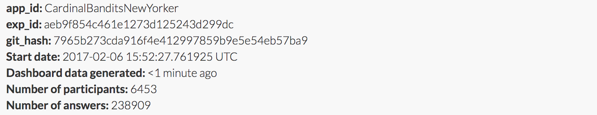
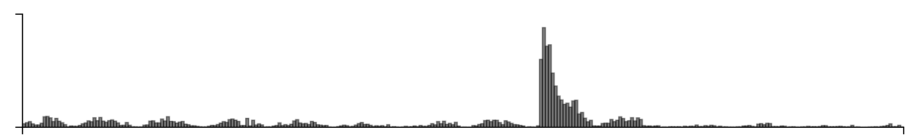

Cardinal bandits (aka "how funny is this caption?")

Histogram of when people responded:

Example query:

This caption contest was also live on the New Yorker caption contest page
(reloading, ads).

This week, for all captions that had at least one duplicate caption, I included a single, exact duplicate of the original caption for comparison purposes. These duplicate captions are listed below:

> * Is there something you're not telling me?
> * So just how many ectoplasm meals do we have to have till that suit pays for itself?
> * Liver and onions again?
> * Onions again?
> * Your cooking is out of this world.
> * Fish again?
> * Houston, we have an omelette.
> * Ricin beans again?
> * Was it something I said?
> * Should I be worried?
> * Durian again?
> * New recipe?
> * Ground Control to Major Mom...
> * r
> * Fried beans again?
> * Is there something I should know?
> * So you don't like my new cologne?
> * Dior?
> * Toxic waste again?
> * Are you sure it calls for mustard gas?
> * Open the oven door, Hal!
> * You seem a little distant.
> * Suit yourself
> * Chernobyl chicken again?
> * Brussels sprouts again?
> * New suit?
> * Toast?
> * You look hot in that outfit.
> * Onions?
> * Not liver and onions again!
> * No, it doesn't make you look fat.
> * Five-alarm chili again?
> * Do you know something I don't know?
> * Tanqueray tonic and Span...again?
> * You seem distant.
> * I need some space.
> * Your cooking isn't THAT bad.
> * I just need some space.
> * So,...what's for dinner?
> * Mmmm, that smells out of this world!
> * Are we expecting my mother for dinner?
> * None for me, thanks.
> * You could've just told me you had a headache.
> * Do you need some space?
> * And you expect me to eat that?
> * I hope it tastes better than it smells
> * This recipe is to die for
> * You know, you could just leave the onions out.
> * Can I have your wine?
> * Looks like a recipe for disaster.
> * Do you smell gas?
> * So now you're cooking with alternative facts?
> * I think we need some space
> * Can you hear me now?
> * Wouldn't it be easier to just buy organic?
> * Will you be joining me for dinner?
> * You said you needed some space.
> * Are you mad at me?
> * Is my mother coming for dinner?
> * Aren't you taking this vegan think a bit too far?
> * Is it me, or the new EPA?
> * If you can't stand the smell, get out of the kitchen.
> * That's one small meal for a man.
> * I see my 'toxic personality' crack is still on the table.
> * I'm sensing you need some space.
> * Beans again ?
> * Tuna meltdown tonight?
> * What do you mean you need space?
> * So how was your day?
> * It's only bacon.
> * One of these days, Alice!
> * I love what you've done with your air.
