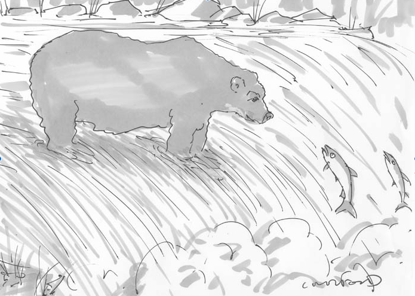

In the `_cardinal` experiments, participants were asked to rate how funny a
caption was as "unfunny", "somewhat funny" or "funny".

In the `_dueling` experiments, participants were asked to choose between the
funniest of two captions.

Round 1 was released with about many captions, over 1000. From this, a smaller
number were selected (<100) were selected. With this smaller set of captions,
we created a two part round 2 experiment. We asked the user to

1. Rate how funny each one of the 50 captions were (unfunny, somewhat funny,
   funny)
2. Make unlimited pairwise comparisons. Is this caption funnier than the other
   caption?

## Numerics:
### Round 1, cardinal
* Number of participants: 386
* Number of questions answered: 91,632
* Start date: 2016-02-16

*Note: we will put these online shortly*

### Round 2, cardinal
Participants were shown the top 50 captions, each one time.

* Number of participants: 377
* Number of questions answered: 8,603
* Start date: 2016-02-18

### Round 2, dueling
Participants could compare as many caption pairs as they would like.

* Number of participants: 279
* Number of questions answered: 24,052
* Start date: 2016-02-18

This experiment only uses the "BR_Random" sampling strategy -- it is unbiased
and makes no decisions on which questions to ask based on previous responses.
The generation of each question happens at random and is not based on previous
responses.

## Example queries
Example queries can be found in the parent directory for both dueling and
cardinal experiments. Of course, the cartoons in those captions were replaced
with `509.png`:

