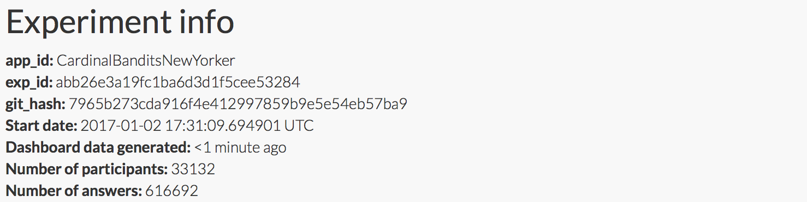

Cardinal bandits (aka "how funny is this caption?")

Histogram of when people responded:

Example query:

This caption contest was also live on the New Yorker caption contest page
(reloading, ads).

This week, for all captions that had at least one duplicate caption, I included a single, exact duplicate of the original caption for comparison purposes. These duplicate captions are listed below:

> * We're gonna need a bigger comb.
> * Don't worry it's Trump l'oeil.
> * Hurricane Donald!
> * Take a deep breath and hold it for four years.
> * I don't do the email thing.
> * Small hands on deck!
> * "If we can make it here, we'll make it anywhere"!
> * The wave of the future?
> * Thar he blows!
> * He really DOES have small hands.
> * We're Saved!
> * Entitled wave!
> * Fuck.
> * You're Fired!
> * Great.
> * Trump'eau.
> * It's yuge!
> * Row, row, row your boat, gently down the stream...
> * Everybody wave!!!!!!!!!!!!
> * Losers!
> * Comboverboard!
> * Swamp the drain.
> * Oh swell no.
> * I think we're gonna need a bigger boat...
> * So much for draining the swamp.
> * With hair like that how dangerous can it be?
> * Trump-nami!
> * I would have preferred a wall.
> * Was it something I said?
> * HA!
> * There's no escaping "The Donald".
> * Wave, everybody!
> * Oh NO! ... it's the Trump sea wall!
> * Oh no! Trump!
> * Look, Trump is waving at us!
> * Such small hands...
> * 'Not my Tsunami'
> * Rogue Wall!
> * This is our wave of the future!
> * SUE-nami!
> * Let's give it a chance.
> * So this is what he meant by extreme wetting.
> * Surf's up?
> * Don't blame me - I voted for Hillary!
> * Trump Ahoy!
> * Don't worry, it is a hoax!
> * Is this what they mean by extreme wetting?
> * Merrily, merrily, merrily, merrily, life is but a dream ...
> * Give it a chance.
> * We're gonna need a whiter boat"
> * This wave is Yuge
> * I lift my lamp beside the golden boor.
> * Swamped!
> * Wave goodby!
> * This wasn't in the forecast.
> * Row v. Wave
> * Extreme vetting!
> * "So this is 'extreme vetting'!
> * I thought he said wall, not swell!
> * Hold on to your pussies.
> * Maybe it won't be that bad.
> * Sure has small hands for such a big wave.
> * Don't worry, he promised to keep us safe.
> * It's a sue-nami!
> * ACTUALLY, WE'RE LEAVING!!!
> * Is that a toupee?
> * Don't take it literally.
> * We shall overcomb.
> * Give me your tired, your poor, your huddled masses...
> * Hair we go!!!
> * Let's bail.
> * We're going to need a huger boat.
> * Global warming!
> * OK everyone, hold for the extreme vetting!
> * Welcome to Staten Island
> * Hold on, everyone. We've got hell AND high water coming.
> * Look out...it's the Great Weave!
> * The sea was angry that day, my friends.
> * What do we have to lose?
> * That wave is yuuuuuge.
> * Hey--it's Alec Baldwin!
