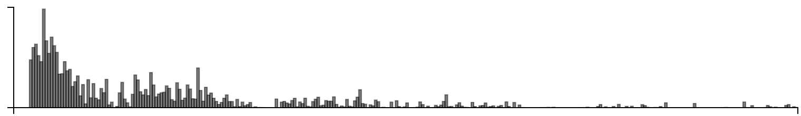
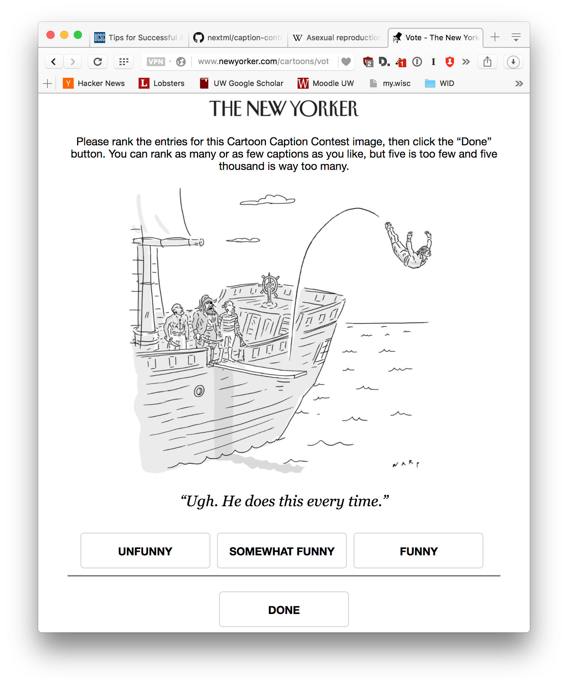

### Active contest

### Random contest

In this contest we ran the two active algorithms with the top 50 captions from
both experiments. After they completed, we ran random sampling with the top 50
captions from both trials, and another random 50 captions to find the true
winner.

This week, for all captions that had at least one duplicate caption, I included a single, exact duplicate of the original caption for comparison purposes. These duplicate captions are listed below:

> * Well executed!
> * Show off.
> * 9.5
> * I said swan song, not swan dive!
> * Mutiny on the Bouncy!
> * I give him a 9.5!
> * Black beards favorite past time was to judge the execution of each diver.
> * Nice booty.
> * Talk about going overboard.
> * Nobody likes a showoff!
> * Smart-ass!
> * Nine point five
> * ...and don't come back.
> * Methinks he's done this before!
> * Flawless execution.
> * Great execution.
> * Shiver me swimmers.
> * I'd give him an '8'
> * Perfect execution.
> * Always was a showoff.
> * 9, 8.5, 9.5
> * We'll see if he can stick the entry.
> * Who does he think he is, Peter Pan?
> * 10. 10. 10.
> * Arr…and a 10.0 for execution.
> * Gold
> * 9.5, 9.7, 9.6...
> * Killjoy!
> * Ten for execution.
> * Perfectly executed
> * I prefer his cannonball.
> * I'd give it a 10 for execution.
> * Now that's a swan song.
> * he wants to make walking the plank great again.
> * A show off to the very end.
> * That's not a cannonball.
> * I said walk the plank and die not dive.
> * Always the showoff!
> * Nice execution!
> * Nice arrrrrc.
> * He always was a show-off!
> * I give him a deep six.
> * Cannonball!
> * He always had a flair for the dramatic.
> * Pan overboard.
> * 8, 10, 7
> * I'd give it a 9.0.
> * Quite a swan song!
> * Such a show off !
> * He's going for the gold.
> * Now that's what I call chutzpah.
> * I said Walk!
> * He's going for gold.
> * Looks like a 9.5 to me.
> * Aaargh!
> * There's a news guy in Plank Walking.
> * He wants to go out with a splash.
> * once a shw-off, always a show-off
> * That's a nine
> * Talk about a man going overboard.
> * Who knew?
> * I'll give him a 10 for execution.
> * Look a perfect 10
> * Step back men, he could still turn this into a cannonball.
> * Ta Da!
> * I like his attitude.
> * What a showoff!
> * You call that walking?
> * Kinda takes the fun out of it...
> * I said WALK the plank!
> * It's his swan song.
> * Now, that's what I call execution.
> * Beautiful execution.
> * I rest my case.
> * damn millenials
> * Definitely a 10.
> * He's such a show-off
> * Well, I swan!
> * So far I'd give him an 8.5
> * Talk about going out in style.
> * Swan Song
> * Maybe he knows something we don't?
> * He's done this before.
> * I'd give it a seven.
> * I said cannonball!
> * Walkin the plank ain't what it used to be!
> * What a twat.
> * He always did have a flair for the dramatic.
> * He swore he couldn't swim.
> * A perfect 10!
> * Now that's what I call a perfect execution.
> * The Dread Pirate Louganis
> * Well, give him a 10 for form.
> * I said, "Swan SONG!"
> * We should have keelhauled him.
> * I said die not dive !
> * 8.0, 7.5, 8.5.
> * At least he died doing what he loved.
> * The last straw wich breaks the camel's back
> * "I give that a perfect 10"!
> * That's the third time this week...
> * Fake swan dive.
> * Outstanding execution.
> * What part of 'walk the plank' did you not understand?
> * 9 out of 10
> * Sort of takes the fun out of it.
> * Nothing in his life became him like the leaving it.
> * Now that’s how you jump to a conclusion!
> * Heads or tails?
> * Now THAT'S overboard!
> * Degree of difficulty: 5, execution: 9.5
> * Man, I really hate that guy.
> * Aye, I give him a nine!
> * Now that's a swan dive!
> * Waltzing the Plank
> * A show-off to the end.
> * Thar he blows.
> * I told him it was his swan SONG.
> * Now that's going out with style.
> * I'll give that a 6.5
> * Well, it is his swan song.
> * It's always about HIM
> * Too little too late!
> * Arr, I give it a 7.5.
> * Always had to have the last word!
> * Another flawless execution!
> * Look at that arc!
