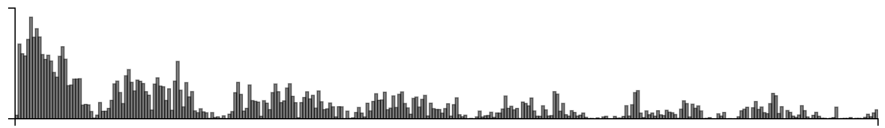
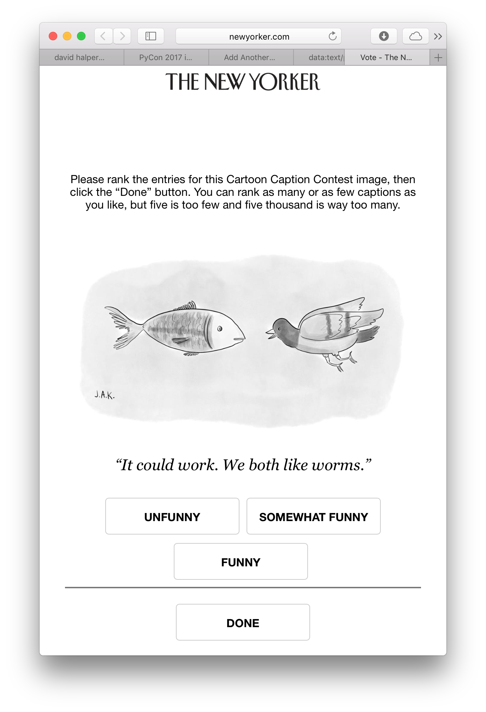

## Funny

Cardinal bandits (aka "how funny is this caption?")

Histogram of when people responded:

Example query:

This caption contest was also live on the New Yorker caption contest page
(reloading, ads).

This week, for all captions that had at least one duplicate caption, I included a single, exact duplicate of the original caption for comparison purposes. These duplicate captions are listed below:

> * One of us is dreaming.
> * I'm lost.
> * One of us is out of our element.
> * No. You're out of your element.
> * Your place or mine?
> * "Are you flying or am I swimming" ?
> * z
> * One of us is a fish out of water.
> * Funny meeting you here.
> * Fancy running into you here...
> * You look like a fish out of water!
> * It's not the heat, it's the humidity.
> * Please tell me you're a flying fish.
> * We've got to stop meeting like this.
> * Fish gotta swim; birds gotta fly.
> * You are out of your depth.
> * Birds gotta swim; fish gotta fly.
> * Willing suspension of animation
> * One of us is in deep trouble.
> * Don't look down.
> * One of us is in big trouble.
> * I feel like a fish out of water!
> * One of us is screwed.
> * OOPS!
> * Stay in your lane!
> * But where would we build a home?
> * One of us has a problem....
> * Let me guess...Pisces.
> * Humid enough for ya?
> * One of us is in a lot of trouble....
> * I don't see species.
> * Ever feel like a fish out of water?
> * One of us is lost!
> * This is the future that liberals want.
> * Long time no see.
> * What are you doing here?
> * Can you hear me now?
> * One of us is having a really bad day.
> * It's not you, it's me.
> * One of us is in the wrong cartoon.
> * Hey! You! Get off of my cloud!
> * Tweet?
> * Fish gotta swim, birds gotta fly. I gotta love one man till I die. Can't help lovin' that man of mine!
> * Somethings fishy here!
> * Do you come here often?
> * Have you seen my worm?
> * I'm an exchange student.
> * Did you get my tweet?
> * Fish gotta swim and birds gotta fly.
> * One of us is in trouble!
> * One of us is way out of our element.
> * No, it's fish gotta SWIM, birds gotta FLY.
> * I refuse to be pigeonholed.
> * You don't look anything like your profile picture.
> * One of us is in serious trouble.
> * Come here often?
> * I'm neither fish nor fowl.
> * "We can't keep on meeting like this".
> * Shouldn't you be in school?
> * do you tweet
> * One of us is in the wrong place
> * just don't look down!
> * I gotta love one man 'til I die.
> * Flyfishing?
> * Can you believe this humidity?
> * Pigs are flying too!
> * One of us doesn't belong here!
> * I'm transitioning.
> * Wow! I guess sea levels really are rising.
> * What brings you here?
> * Fancy seeing you here.
> * Can't help lovin' dat man of mine.
> * Neither!
> * Take me to your leader.
> * The medium IS the message!
> * I've never dated a Pisces before.
> * Let's just agree to disagree.
> * We have to stop meeting like this.
> * when you go low, we go high.
> * 'Talk about a fish out of water!'
> * Well.. this is awkward.
> * One of us shouldn't be here.
> * You don't look like your profile picture either.
> * You really are a fish out of water.
> * Come fly with me
> * What's up?
> * Wow, you're a fish out of water.
> * Fish or Fowl
> * Who said, "Fish got to swim birds got to fly."?
> * No, I’m pretty sure it’s “Fish gotta swim, BIRDS gotta fly.”
> * I think I'm out of my element
> * A fish out of water? Wow, you're a real idiom!
> * Once of us is hallucinating!
> * You're not from around here, are you?
> * One of us is wrong.
> * Birds gotta swim and fish gotta fly.
> * Are you the fish out of water?
> * One of us has a serious problem.
> * Are you swimming or am I flying?
> * One of us is in for a rude awakening
> * I hope you're a flying fish!
> * You're in my lane
> * Well, one of us is going to have to change.
> * Are you a flying fish?
> * We can't go on meeting like this.
> * Do you know the way to San Jose?
> * One of us is fake news.
> * fish got to swim, birds got to fly
> * Let's agree to disagree.
> * Where's the pig?
> * Am I drowning, or are you flying?
> * One of us is very lost.
> * Are you flying or am I drowning?
> * what water?
> * You looked different in your Tinder profile.
> * Wanna switch?
> * My place or yours?
> * You're a fish out of water.
> * I love you too, but where will we live?
> * Well, one of us is screwed.
> * We don't GOTTA do nuthin'.
> * I'm a bird out of air.
> * I'm out of my element.
> * Aren't you supposed to be in school?
> * Wawa
> * I identify as fish
> * Aren't you a little out of your element?
> * One of us made a wrong turn
> * What's a girl like you doing in a place like this?
> * I thought it was fish gotta swim, birds gotta fly!
> * Exocoetidae, I presume?
> * I'm game if you are.
> * Let's face it, you're a fish out of water.
> * One of us has made a terrible mistake.
> * You tweeted?
> * There's something fishy going on here.
> * I hate this dream.
> * No. I'm pretty sure it goes, 'fish gotta swim, birds gotta fly.'
> * You're going the wrong way!
> * You new here?
> * Go, fish.
> * Are You My Mother?
> * This is water.
> * But, where would we live?
> * I know you are, but what am I?
> * Well! Aren't you a fish out of water!
> * Are you high?!
> * Don't hold your breath.
> * Is this my dream, or yours?
> * ????
> * donny, you are out of your element
> * Are you my perch?
> * Aren't you out of your element?
> * Am I swimming or are you flying?
> * No - fish gotta swim!
> * Something's fishy.
> * are you Cod?
> * You're new around here, aren't you?
> * Which one of us is lost?
> * Global warming?
> * Where's the Beef?
> * What's climate change?
> * Oh my Cawd
> * Either you're a flying fish or I'm a dead duck.
> * Have you seen Escher?
> * Climate change?
> * Humid, isn't it?
> * Which one of us is dreaming?
> * There's something fishy here.
> * One of us is in the wrong neighborhood.
> * You're pretty fly for a whitefish.
> * If I can swim, why can't you fly?
> * Got wings?
> * One of us is seriously lost.
> * Don't you feel like a fish out of water?
> * Sorry. My mistake.
> * Can I borrow a fin?
> * Why did the chicken cross the road?
> * 'but can you sing?'
> * Fish out of water?
> * This is not going to end well for one of us.
> * How long can you hold your breath?
> * If I can swim you can fly
> * I'm a stool pigeon.
> * You must be a fish out of water.
> * Alternative Fact: Fish Can Fly.
> * But where would we raise the kids?
> * Where are we?
> * I'll believe that when pigs walk.
> * One of us it totally screwed.
> * Are you fish or fowl?
> * Is this the deep south?
> * "Do you ever feel like a fish out of water"?
> * Now do you believe in global warming?
> * Have you ever heard of M. C. Escher?
> * They're water wings.
> * One of us is going to die.
> * Are you Nemo?
> * Sometimes I feel like a fish out of water
> * You can't get there from here.
> * You look nothing like your profile picture.
> * I KNEW I should have made that left turn at Albuquerque!
> * No, it goes "fish gotta swim, birds gotta fly".
> * Ready?
> * New around here?
> * I'm sorry, it's not you, it's me.
> * Huh! I was expecting a pig.
> * I think one of us is lost.
> * Birds gotta fly, fish gotta swim.
> * I'm a fish out of water.
> * whatever you do, don't look down.
> * Escher sent me.
> * I self-identify as a fish.
> * So, have you seen the pig?
> * I hope you're a fish out of water.
> * It could work. We both like worms.
> * What the hell is water?
> * No, YOU are the fish out of water.
> * No school today?
> * Your move or mine?
> * May I borrow your bicycle?
> * I was expecting a pig.
> * Are you in my dream, or am I in yours?
> * What's up duck?
> * Where is the bathroom?
> * Crazy weather we're having.
> * Romeo, Romeo, wherefore art thou Romeo?
> * Holy Mackerel!
> * I'm "The Pigeon of the Sea!"
