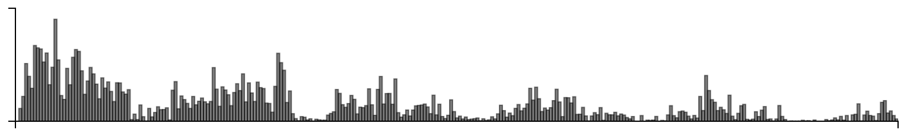
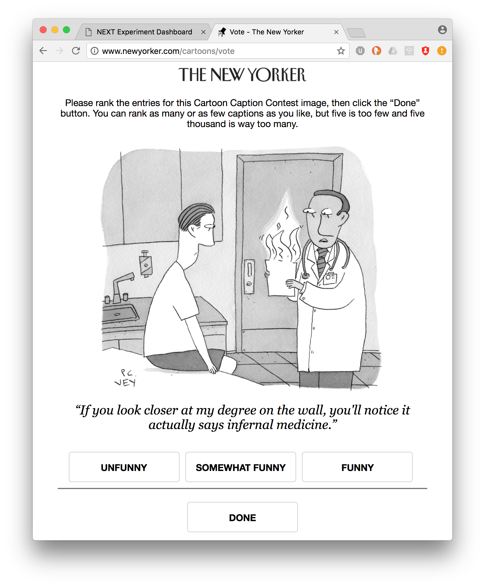

## Funny

Cardinal bandits (aka "how funny is this caption?")

Histogram of when people responded:

Example query:

This caption contest was also live on the New Yorker caption contest page
(reloading, ads).

This week, for all captions that had at least one duplicate caption, I included a single, exact duplicate of the original caption for comparison purposes. These duplicate captions are listed below:

> * Our new lab works for the NSA.
> * Nothing to be embarrassed about, Mr. Torch. Just a little super power incontinence.
> * I have good news and bad news.
> * Trumpcare.
> * But the good news is...
> * Here are your test results -- hot off the press.
> * You're going to Hell
> * You're a wizard Harry!
> * What preexisting conditions?
> * It's worse than I thought.
> * Worst case of heartburn I've ever seen.
> * We take patient confidentiality very seriously.
> * We're going paperless.
> * Yep. Heartburn.
> * No news is good news.
> * You temperature is off the charts.
> * We take HIPAA very seriously.
> * You're toast
> * Oy Vey!
> * Your test results are off the charts.
> * Do you want the good news or the bad news?
> * Have you been experiencing a burning sensation?
> * You temperature is a little high.
> * It's not as bad as it looks.
> * I see you have been having some inflammatory problems.
> * Liar liar charts on fire
> * Hemorrhoids.
> * Let's start with the good news.
> * It's just inflammation.
> * It’s the worst case of acid reflux I’ve ever seen!
> * You might want a second opinion.
> * So do you want the good news or the bad news first?
> * This is the worst case of inflammatory bowel disease I've ever seen.
> * It's the worst case of inflammation that I've ever seen!
> * Make a wish
> * Hell if I know . . .
> * Your blood pressure is a little high.
> * There's no cause for alarm.
> * I've seen worse.
> * Now, about your hemorrhoids...
> * You want the good news first?
> * I recommend an anti-inflammatory.
> * Your heartburn is off the charts.
> * Your secret is safe with me....
> * It's our new privacy policy.
> * You're fired.
> * Firest, the bad news.
> * You may experience a burning sensation...
> * This is the worst case of heartburn I've ever seen.
> * I'm afraid it's bad news.
> * It's getting hot in here, so take off all your clothes...
> * This is your brain on drugs.
> * I'm afraid you have pyromyalgia.
> * Worst case of acid reflux I've ever seen.
> * Which do you want first? The good news or the bad news
> * Your test results indicate heartburn.
> * Your acid reflux is flaring up again.
> * your inflammation levels are off the chart!
> * You have chartburn.
> * You'll need to take a chill pill...
> * Now let's test your reflexes....
> * It's not good news.
> * I have your test results.
> * Any burning sensation?
> * "This is what I think of your "Second opinion"!
> * Your fever is off the charts!
> * Say
> * you have a bad case of chart burn
> * Worst case of hemorrhoids I've ever seen!
> * And, do you feel a burning sensation?
> * It burns when I pee.
> * First, the good news.
> * It's a new HIPAA requirement.
> * This is the worst case of gonorrhea I've ever seen.
> * Well, it's definitely not a cold.
> * Tell me more about this burning sensation.
> * You might feel a slight burning sensation
> * I'm afraid I have some bad news...
> * I see you're still smoking.
> * You have a case of spontaneous combustion.
> * You have the worst case of heart burn I've ever seen!
> * The devil's in the detail
> * Bad news or good news first?
> * Your inflammation is off the chart
> * Liar ,Liar... Your chart's on fire!
> * Do you want the good news, first, or the bad news?
> * You don't want to know.
> * Your test results look like hell!
> * Well, your lab results are back.
> * We're going digital.
> * New HIPAA regulation!
> * It appears to be an inflammation.
> * Now would be a good time for that urine sample
> * The inflammation is worse than we thought.
> * I'm not sure you'll be able to handle this.
> * HIPPA!
> * I'll prescribe an anti-inflammatory.
> * The inflammation is even worse than I thought.
> * Even your chart is inflamed.
> * Your heartburn results are back.
> * You've got to lighten up on the Thai food!
> * It's definitely heartburn.
> * I've got some bad news.
> * This diagnosis will self-destruct in five seconds.
> * I see you have a history of inflammation.
> * This doesn't end well.
> * This is fine.
> * I'm referring you to an exorcist.
> * This can't be good.
> * Well this is a first
> * Ok, now if you'll just bend over for me....
> * You really need to stop smoking.
> * Oh, it's a new HIPAA regulation.
> * Would you describe it as a burning sensation?
> * HIPAA compliance!
> * I've got some good news and some hot news
> * Looks like inflammation.
> * Goodness, gracious, great balls of fire.
> * You're a hot mess....
> * The burning question is....
> * Well, it's definitely inflamed.
> * You do have heartburn
> * The inflammation has spread!
> * I have the results of your STD tests.
> * Any family history of spontaneous combustion?
> * i'm afraid it's not just heartburn.
> * Does it burn when you pee?
> * No more pre-xisting condition
