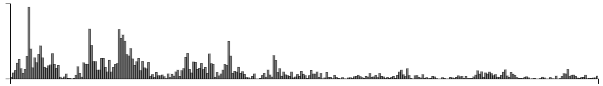

## Funny

Cardinal bandits (aka "how funny is this caption?")

Histogram of when people responded:

Example query:

This caption contest was also live on the New Yorker caption contest page
(reloading, ads).

This week, for all captions that had at least one duplicate caption, I included a single, exact duplicate of the original caption for comparison purposes. These duplicate captions are listed below:

> * a
> * Thar she meows!
> * It's a galley-cat.
> * He calls it Ishmeow
> * There she purrs!
> * He calls him Ismael
> * It's a cat-o-one tail
> * Should we tell him we've spotted the white whale?""Nah, it'll keep.
> * Call me Fishmeal.
> * He calls it Moby Lick.
> * It's a therapy cat
> * The rodent problem was never fixed.
> * He calls her Fishmeal.
> * They call him Ish-meow.
> * ...some sort of symbiotic relationship. He scratches her and she scratches his peg-leg
> * Be careful; it might have flees
> * His leg doubles as a scratching post.
> * We're gonna need a bigger cat.
> * She only loves him for his scratching post.
> * Call me Mr.Whiskers.
> * He named her Peg
> * Wouldn't be countin' on booty, Rudy
> * What happened to the parrot?
> * He's going to call him Ishmael.
> * Call him Ishmeow.
> * Look what the cat dragged in.
> * Call him Captain Rehab.
> * I used to be his favorite.
> * Call me Ishmeow'el.
> * It's his service animal
> * Who let the cat out of the bag?
> * He used to be a "whale person".
> * I guess the cat's out of the bag.
> * Well, call me Ishmew.
> * The Cat ate his parrot.
> * I'm more of a dog person
> * Have you seen my parrot?
