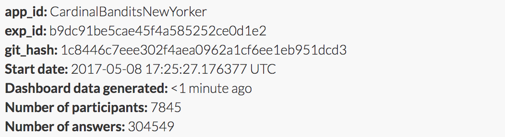
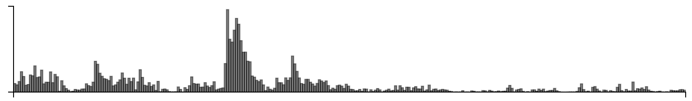
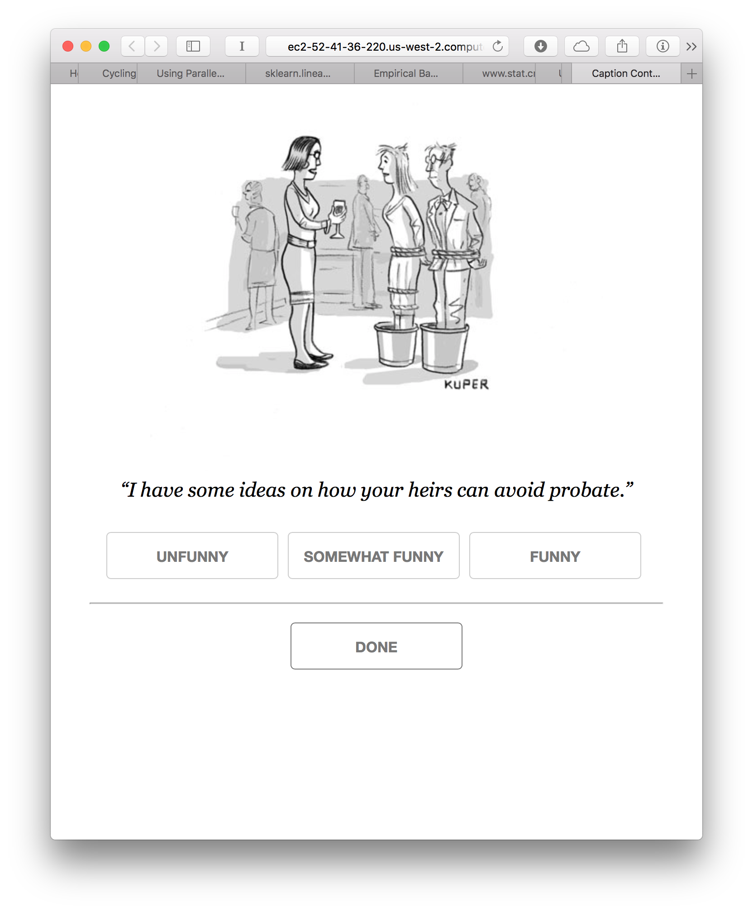

Cardinal bandits (aka "how funny is this caption?")

Histogram of when people responded:

Example query:

This caption contest was also live on the New Yorker caption contest page
(reloading, ads).

This week, for all captions that had at least one duplicate caption, I included a single, exact duplicate of the original caption for comparison purposes. These duplicate captions are listed below:

> * dfg
> * Bon Voyage
> * I admire your restraint.
> * Love the shoes!
> * So how did you two meet?
> * Bottoms up
> * So, when did you two tie the knots?
> * BROKE nan 860
> * BROKE AT 860
> * You look like you could use the drink.
> * I'm drawing a blank.
> * So Canada said no to your immigration application?
> * Those shoes are to die for.
> * Last call!
> * Leaving so soon?
> * Potted already?
> * i now pronounce you man and wife
> * Step 13?
> * Water?
> * So, what's on your bucket list?
> * So glad you could make it.
> * Do you come here often?
> * But enough about me.
> * So, where did you two meet?
> * Can I get you anything.?
> * Here's to cementing our friendship.
> * I love a captive audience.
> * Shaken?....or Stirred?
> * Will you be staying for dinner?
> * Who are you wearing?
> * Are you the artists?
> * I just love a captive audience!
> * Finally! A captive audience!
> * Didn't you get the memo? Dress semi-formall.
> * Cheers!
> * I'll bet this wasn't on your bucket list.
> * So, come here often?
> * Can I get you a drink?
> * We may need to rethink this icebreaker.
> * Would you like two straws?
> * Bottoms Down
> * So I guess this is on your bucket list?
> * You're toast.
> * I'll never understand modern art.
> * So, when did you tie the knot?
> * So how was the cruise?
> * Was this on your bucket list?
> * Are you two together?
> * Red or white?
> * Until death do you part
> * So how do you know Vito?
> * Drink?
> * Now that I have your undivided attention.
> * Loosen up!
> * So, how do you know Tony?
> * You're such good listeners.
> * The important thing is that you showed up.
> * Clean feet at an S&M party is very important!
> * As I was saying -
> * I'll be your somolinetrex this evening.
> * And now how will you be voting on the repeal of Obamacare?
> * Now that I have your attention...
> * So what else is on your bucket list?
> * So, how do you know the host?
> * How was your flight?
> * I knew you were bound to show up.
> * May I offer you the drink?
> * This wine is to die for.
> * You were both on my bucket list
> * Here's mud in your eyes.
> * Cat got your tongue?
> * So what do you do for a living?
> * What are you doing after the party?
> * Congratulations on tying the knot.
> * Two shots and a splash?
> * So how do you know Fat Tony?
> * Would you like a drink?
> * So what's your safe word?
> *
> * So, how did you meet?
> * We have ways of making you small-talk.
> * Can I call you an Uber?
> * So...what do you do?
> * It's my party and I'll tie if I want to.
