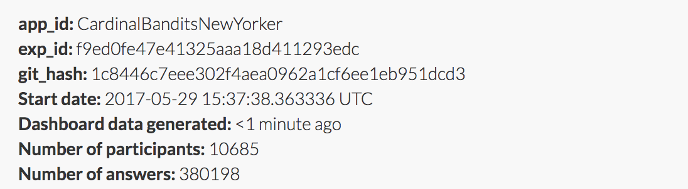

Cardinal bandits (aka "how funny is this caption?")

Histogram of when people responded:

Example query:

This caption contest was also live on the New Yorker caption contest page
(reloading, ads).

This week, for all captions that had at least one duplicate caption, I included a single, exact duplicate of the original caption for comparison purposes. These duplicate captions are listed below:

> * We're the anchor tenant.
> * Welcome to Starrrrrrrrbucks
> * Welcome to Arrrrbucks, may I take your order?
> * Yo ho! Yo ho! A barista's life for me!
> * It keeps me grounded.
> * Anchor's in the way!
> * Anchor's astray...
> * Thar she brews!
> * Aye, welcome to Aarrrbucks.
> * It's my anchor, baby!
> * One day my ship will come in.
> * Ship happens.
> * Annchor's in the way me boys?
> * It's Starbuck's.
> * Welcome to Arrbucks.
> * My ex-wife got the rest.
> * nope
> * What makes you think it's mine?
> * I am waiting for my ship to come in!
> * Anchor Away!
> * "I said 'away,' not 'aweigh"!
> * Welcome to StAAARRRbucks!
> * What anchor?
> * It's me emotional support anchor.
> * It's me therapy anchor.
> * You should have seen the one that got away.
> * Hey
> * Arghbucks
> * Just tell me where Mr. Starbuck is and I'll be out your hair.
> * We're going to need a bigger boat.
> * I guess he intends to stay...
> * Anchor what?
> * Anchors away, my boys!
> * Anchors in the way, my boys. Anchors in the way.
> * I said "Anchors AWAY"
> * They say I have anchor management issues
> * Which one 'o ye loiter-sacks ordered th' fish 'n chips.
> * I guess they don't plan on relocating.
> * A soy maté.
> * The wifi password is 'anchor.'
> * It's good to the last drop.
> * Welcome to Starrghbucks.
> * Why does everyone assume it's mine?
> * Just waiting for my ship to come in.
> * it's just a fluke
> * Arg! I dropped anchor on that scurvy mermaid.
