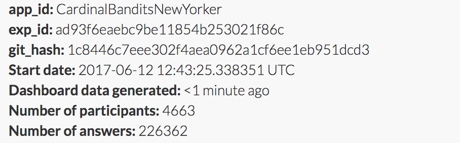

Cardinal bandits (aka "how funny is this caption?")

Histogram of when people responded:

Example query:

This caption contest was also live on the New Yorker caption contest page
(reloading, ads).

This week, for all captions that had at least one duplicate caption, I included a single, exact duplicate of the original caption for comparison purposes. These duplicate captions are listed below:

> * I feel so inaqequate.
> * Size matters.
> * It's blockbustet season.
> * The day the sunscreen expired... the life of helicopter parents.
> * You should see his raft.
> * Blow!
> * I guess size does matter.
> * See, size does matter.
> * 'I thought it was a 'Bring Your Own Ball' party'
> * We're gonna need a bigger pool
> * Size does matter.
> * Got a pin ?
> * We're going to need a bigger pool.
> * Inflation.
> * Size isn't everything.
> * Honey, have you seen the kids?
> * Shrinkage.
> * Marco?
> * Welcome to Texas!
> * We need a bigger pool!
> * Size doesn't matter honey.
> * The instructions said, "Just add water."
> * Everything's bigger in Texas.
> * I see you have the salesman sample.
> * What happens in the pool, stays in the pool.
> * I got it at Costco.
> * "Too little, too late!'
> * Costco.
> * I can't swim.
> * Bigger isn't always better.
> * Sometimes size does matter.
> * Beach ball envy
> * Show off.
> * The directions said "Just add water."
> * Have you seen my other beach ball?
> * I forgot to adjust for inflation.
> * It must be something in the water.
> * They expand in water.
> * Glow ball warning!
> * It's not the size that counts.
> * Just because you can, doesn't mean you should.
> * Now that's s beach ball!
> * Contrary to popular belief Harold, size doesn't matter.
> * It said, "just add water?"
> * Just add water.
> * One word: plastics.
> * Mine's bigger.
> * Sometimes, size matters.
> * Pool ball...
> * My ball is bigger than yours.
> * Apparently, size matters.
> * Covfefe?
> * Someone's overcompensating.
> * They always have to outdo us
> * The package said 'Just Add Water'
> * It's Donald's
> * I've found someone else.
> * I told him to stop blowing.
> * I like to blow things out of proportion.
> * It's Trump's beachball.
> * Ours is bigger.
> * It's a bigly beach ball.
> * Have you seen the kids?
> * Go big or go home.
> * I thought the drought was over?
> * You might as well take your ball and go home.
> * It's not the size, it's how you use it.
> * It's a boy!
> * Sorry but size does matter
> * '' Damn Costco! "
> * We've got it covered.
> * I told you size matters
> * Apparently size DOES matter.
> * His is bigger than mine.
> * I told you not to invite Koons.
> * They grow up so fast
> * I blame inflation.
> * I'm taking my ball and going home.
> * I'm sorry, but size really does matter.
> * But, where are the children?
> * See, bigger isn't always better.
> * Have you seen my ball?
> * I told you not to overinflate it.
> * Runaway inflation.
> * I told you his was bigger than yours.
> * I adjusted for inflation.
> * Where's mom?
> * I think size does matter.
> * It's the thought that counts.
> * Who invited Trump?
> *
> * This is so embarrassing!
> * We already have a beach ball.
> * I like big balls, and I cannot lie.
> * How many times do I have to tell you size doesn't matter?
> * I see the Joneses are here.
> * The lifeguard is on break.
> * The label said just add water.
> * You should see his pool noodle.
> * Where's the kiddie pool?
> * No, really, size doesn't matter.
> * Welcome to Mar-a-Lago.
> * Try blowing harder.
> * ... a new glitch has arisen in apple's urine detection software.
> * Who invited Paul Bunyan?
> * This is the son of a beach ball.
> * That's the way the ball bounces.
