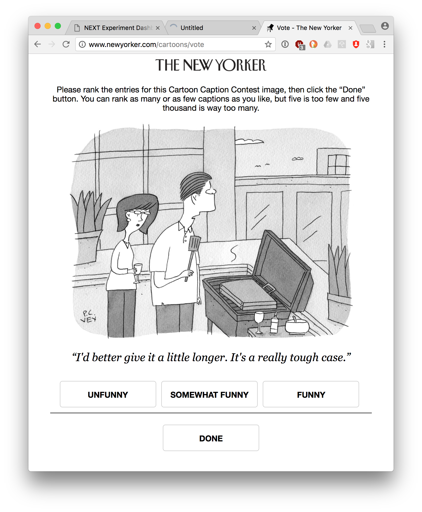

Cardinal bandits (aka "how funny is this caption?")

Histogram of when people responded:

Example query:

This caption contest was also live on the New Yorker caption contest page
(reloading, ads).

This week, for all captions that had at least one duplicate caption, I included a single, exact duplicate of the original caption for comparison purposes. These duplicate captions are listed below:

> * x
> * Well done!
> * Just cooking the books.
> * I'm going to need a larger spatula.
> * I'm cooking the books.
> * Cooking the books again
> * I was told to cook the books.
> * BROKE nan 1080
> * BROKE AT 1080
> * They told me to cook the books.
> * This is going to be a very brief barbecue.
> * My boss told me to cook the books...
> * Another job well done...
> * Beef case
> * A job well done.
> * How do you know when its done?
> * I like my work well done.
> * It's burnt-out.
> * That's what I call a job well done.
> * Honey, I'm cooking the books.
> * Here's to a job well done!
> * It's my top secret recipe.
> * Cooking the books...why?
> * My boss asked me to cook the books.
> * Where's the breef?
> * How do you like your books cooked?
> * Fine. And how was you day?
> * My work here is done.
> * It'll be done briefly.
> * How will we know when it's done?
> * My work is almost done.
> * At least it won't taste like shoe leather.
> * I'm working on a really hot case.
> * I don't think money can do everything anymore...
> * They said my ideas were half-baked.
> * You're going to need a bigger spatula!
> * That's not how they cook the books.
> * Now that's a job well-done.
> * I'll show my boss a job well-done...
> * The Boss said to cook the books.
> * Now that's what I call 'a job well done."
> * I think it's dun.
> * oy Vey.
> * Honey, I don't think that's what they mean by 'cooking the books'.
> * should've brined it.
> * It was a job well done.
> * Is this how you cook the books?
> * The work is never done.
> * Cooking the books again, Fred?
> * The boss likes things well done.
> * It's a bit leathery
> * I've been cooking the books.
> * You want files with that?
> * It's full of half-baked ideas.
> * It's an acquired taste.
> * If you see something swat something
> * I think my work here is done.
> * This is how we cook the books
> * I said beef steak, not brief case...
> * We're gonna need a bigger spatula.
> * I think I overcooked it.
> * I already cooked the books.
> * It's 100% lean.
> * Oh, I'm just cooking the books.
> * this should be brief
> * I'll make this brief.
> * Do you want cheese on it?
> * I think I'll need a bigger spatula.
> * Honey, I don't think your boss meant to literally cook the books.
> * I like a job well done.
> * I've always wanted to cook the books.
> * I think it needs a few more minutes.
> * It's a rare case.
> * How would you like your books cooked?
> * You're fired!
> * Happy Retirement!
> * I hope we marinated it long enough
> * How do I know when to flip it?
> * How do you like your briefcase?
> * I find if you cook the books over an open flame they tend to char.
> * Bad day at the office dear?
> * Should be done briefly.
> * It's rare.
> * The secret's in the sauce.
> * THERE MUST BE ANEASIER WAY TO COOK THE BOOKS
> * I may have misread the recipe.
> * Well Done my dear!
> * It was a cold case.
> * It's a secret recipe.
> * Brief, it's what's for dinner.
> * I got wallets for the kids.
> * I'm cooked!
> * The boss wants me to cook the books
> * They asked me to cook the books.
> * I roast my case.
> * It's never done.
