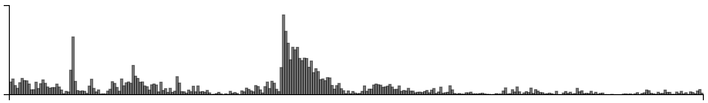

Cardinal bandits (aka "how funny is this caption?")

Histogram of when people responded:

Example query:

This caption contest was also live on the New Yorker caption contest page
(reloading, ads).

This week, for all captions that had at least one duplicate caption, I included
a single, exact duplicate of the original caption for comparison purposes.
These duplicate captions are listed in `{contest}_repeat_captions.csv` (which
is newline delimited).
