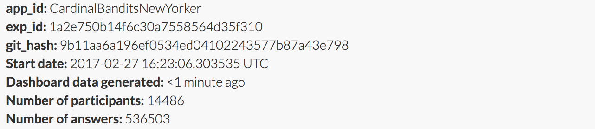
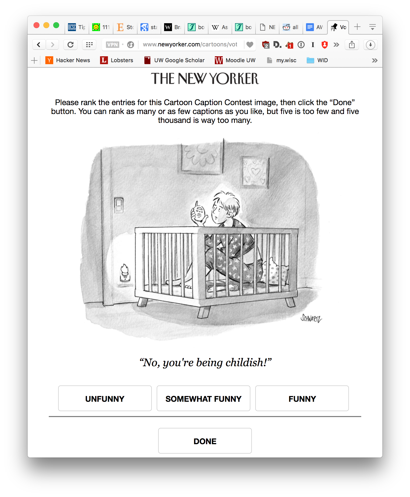

Cardinal bandits (aka "how funny is this caption?")

Histogram of when people responded:

Example query:

This caption contest was also live on the New Yorker caption contest page
(reloading, ads).

This week, for all captions that had at least one duplicate caption, I included a single, exact duplicate of the original caption for comparison purposes. These duplicate captions are listed below:

> * Can you hear me now?
> * Mom, please.....I promise I'll stop imitating the president in front of your friends.
> * This is 'Snowflake' - over...
> * Don't tell me it's apple.
> * Da Da.
> * Has it been 4 years yet?
> * Is he still president?
> * How long was I asleep?
> * Beam me up Scotty....
> * Houston, we have a problem
> * Is it glutton-free?
> * MOM! The meatloaf!
> * I need a change!
> * Is my time out over?
> * Wahhh.
> * Are you there, NSA? It's me, Margaret.
> * Ground control to Major Mom.
> * I'm too old for this sh*t
> * Is there anybody out there?
> * Am I still grounded?
> * S
> * I'm getting too old for this.
> * This is Ground Control to Major Mom.
> * Major Tom to ground control?!
> * Stop calling me a big baby!
> * MOM?
> * Hey, baby!
> * Mom? I'm having that dream again.
> * No, you grow up.
> * Is this thing on?
> * Is my time out over yet?
> * Is it 2020 yet?
> * Is anyone out there?
> * Is Trump still President?
> * Waaaaaaaaaaah.
> * Mom, can I have a sleepover?
> * Who’s my daddy?
> * Hello, room service?
> * Is anybody there?
> * I can hear you too you know...
> * No, you're the big baby!
> * Can anyone hear me?
> * Mom, Dad I think it's time.
> * Beam me up. Now
> * I need to be changed.
> * Is it time to grow up yet?
> * I know why the caged bird sings.
> * Am I still in timeout?
> * Is anyone listening?
> * I'm 10-4!
> * Mom, I'm hungry.
