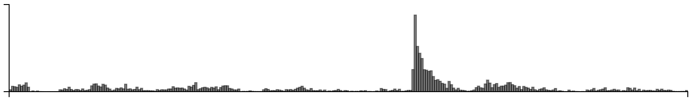

## Funny

Cardinal bandits (aka "how funny is this caption?")

Histogram of when people responded:

Example query:

This caption contest was also live on the New Yorker caption contest page
(reloading, ads).

This week, for all captions that had at least one duplicate caption, I included a single, exact duplicate of the original caption for comparison purposes. These duplicate captions are listed below:

> * Who?
> * Frankly, my dear, I don't give a hoot!
> * Marcy, I don't know either if it's to who they belong, or to whom they belong.
> * Hoo...are...you?
> * Whooh ? Me?
> * Yet again, Lockwood had misunderstood Casual Friday.
> * Nice hooters.
> * What do you mean, "why?"
> * We're not so different, you an I.
> * Mr. Popper's Owls?
> * Whooo's on first?
> * Who said that?
> * Actually, it's "whom".
> * What makes you think I give a hoot!
> * Welcome to Hooters.
> * Whoooo were you here to see?
> * Owl be right with you.
> * What owls?
> * Does it look like I give a hoot?
> * Who called?
> * It's whom.
> * Who's next?
> * Hoo is here?
> * No, I don't give a hoot....
> * Have you seen my mouse?
> * Knock. Knock.
> * They don't give a hoot
> * Aren't they a hoot?
> * You hooted, sir?
> * Hoo should I say is calling?
> * Parliament is now in session!
> * This does NOT make you a Member of Parliament!
> * Sorry, but I don't give a hoot.
> * Who's your daddy?
> * Nice hooters, sir.
> * It's bring your owls to work day.
> * The owls are not what they seem.
> * That sounds like a really hoot.
> * I'm sorry, who?
> * Me.
> * Choose wisely
> * They'll be asking to the questions.
> * I give a hoot.
> * Who knows?
> * I still don't give a hoot!
> * Who what?
> * They say owls bring wisdom. So, I'll take one for each cabinet member...and rwio or three for their boss.
> * I just don't give a hoot!
> * Whooo do you think you're talkong to?
> * Meet the new night shift.
> * Welcome to parliament!
> * "No, he's on first"!
> * "Who's" in charge here?
> * Now who's the wise guy?
> * it's not who, it's WHOM.
> * Have you seen the mouse for my computer?
> * WHO, WHO, WHO are you?
> * The wise have it.
> * Frankly, I don't give a Hoot
> * Said hoo?
> * Do you think that's wise?
> * Say "knock-knock.'
> * I don't give a hoot, but they do.
> * Trust me, you wouldn't want to sit if hadn't removed the chairs.
> * I said we needed nine store outlets.
> * Please stop staring at my hooters.
> * You don't look any wiser.
> * Whooo's in charge?
> * I couldn't afford the doves.
> * Who's asking?
> * Hoo, me?
> * Hooters?
> * Pidgeon problem solved.
> * Get me the latest edition of ”Wh's Who."
> * They work the night shift.
> * Welcome to the night shift!
> * Okay, Which one of you out glue on my seat?
> * Who did this?
> * Just tell him I don't give a hoot!
> * Hoo do you do?
> * We need all eyes on desk!
> * Whom!?," not "Who?
> * You've got mail.
> * Frankly, Scarlet, I don't give a hoot!
> * Frankly, I don't give a hoot what you think.
> * I keep losing my mouse.
> * To whom are you speaking?
> * I never give a hoot
> * Quite frankly my dear, I don't give a hoot.
> * BROKE nan 3436
> * BROKE AT 3436
> * Owl ask you later.
> * Hoos calling.
> * I saw a mouse.
> * Do I seem wiser?
> * Just whoo do you think you are?
> * WISE ASS !!
> * They usually work nights.
> * Whose the wisest of them all?
> * Says Who?
> * This job's a hoot!
> * Owl see him now
> * "Do you know who I am"?
> * Whom are you here to see?
> * It's a real Who done it.
> * Who may I say is calling?
> * I don't give a hoot what you think.
> * I really do give a hoot.
> * Whom shall I say is calling?
> * Owl be damned.
> * Who sent you?
> * Ok, WHO said WHAT?
> * They make me look smarter.
> * Whooooo are you looking for?
> * Who's on line one.
> * No 'WISE'cracks!!!
> * And who are you?
> * At least the mice are gone.
> * Parliament is in session!
> * Ho did it?
> * I could give a hoot.
> * "Who"wants to know?
> * Not 'who.' Whom.
> * You are looking for whom?
> * Stop staring at my Hooters
> * Ask me if I give a hoot.
> * More spam from Hogwarts?
> * Actually, I DO give a hoot.
> * Owl be with you in a moment
> * So who gives a hoot?
> * Isn't this a hoot?
> * The question is not what, but who...?
> * Well owl be darned...
> * There's a Dr. Who to see you.
> * Who, who, who, who, who, who, who, who, who are you?
> * Who is who?
> * I'm here for the Hooters interview.
> * I'm afraid of mice.
> * I understand your grievances but you can't beat the working owls
> * Meet the nightshift.
> * Well, owl-be.
> * Spam from Hogwarts.
> * Hoo's Hoo?
> * I hate mice.
> * 'you left the windows open again.'
> * I said, I needed towels, not owls
> * Don't you mean whom?
> * Doctor Who
> * Yes, we now give a hoot!
> * I seem to be missing an owl.
> * I said towels.
> * Who did you say is here?
> * Would you like to buy a owl?
> * It's 'WHO', not 'WHOM'!
> * They're a hoot.
> * So, where are the pussycats?
> * Sorry, I don't give a hoot.
> * Your 3 a.m. is here.
> * They were on sale.
> * Owl get back to you.
> * What makes you think I don't give a hoot?
> * I really need to get off of the Hogwart's mailing list.
> * One of our owls is missing.
> * I can't find my mouse.
> * Who's the boss.
> * I'm running for parliament
> * Owl get right on that.
> * Do you really think that is wise?
> * It's all about hoo you know
> * Let us prey.
> * Who are you? Who, Who, Who, Who?
> * Do these owls make me look Wise?
> * They're Wise Guys.
> * Obviously, I don't give a hoot!
> * With who would you like to speak?
> * Pick an owl, any owl.
> * They were all out of mouse traps
> * No, the glasses don't make you look wiser.
> * Go ahead -- ask me anything.
> * I am still none the wiser
> * Who indeed.
> * For the last time, it's "whom"!
> * No, they don't make you look smarter.
> * Who's here to see me?
