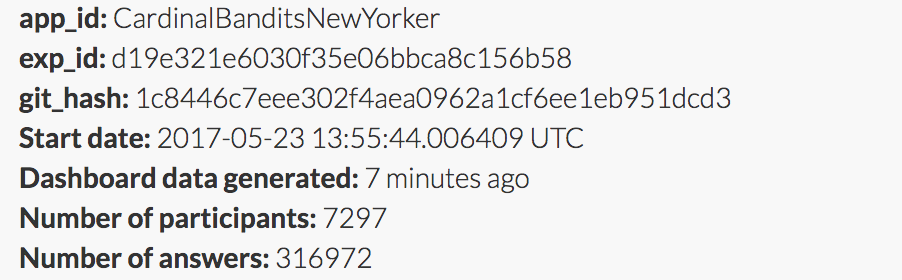
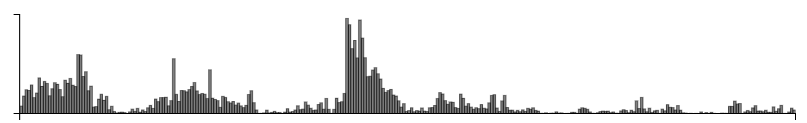

Cardinal bandits (aka "how funny is this caption?")

Histogram of when people responded:

Example query:

This caption contest was also live on the New Yorker caption contest page
(reloading, ads).

This week, for all captions that had at least one duplicate caption, I included a single, exact duplicate of the original caption for comparison purposes. These duplicate captions are listed below:

> * Tippi, is that you?
> * Flock you.
> * Feeling peckish?
> * What's your secret?
> * Nice suet.
> * When did you get out of Alcatraz?
> * I'm more of a dog person, myself.
> * Sorry this reminds of the time I fell into the bird pit at the pet store last week. It was terrifying and I'm a shell of the man I used to be please delete.
> * I know a good dry cleaner.
> * Crummy day eh?
> * Birds of a feather...
> * So how long have you been out of Alcatraz?
> * Do you mind? I'm trying to read.
> * Impressive bird call.
> * Do you mind?
> * That's why I don't tweet.
> * Alfred?
> * Tippi?
> * They seem to like you.
> * Are you a Hitchcock fan?
> * You're not supposed to feed the birds.
> * Maybe you should stop tweeting.
> * Do you come here often?
> * Gone to seed?
> * Bob?
> * Mr. Peanut?
> * Mr. Hitchcock?
> * Didn't you used to be Tippy Hedren?
> * Sue it!
> * Hitch, is that you?
> * I thought you looked seedy.
> * Tippi Hedron was really your grandmother?
> * That's what you get for trying to feed them gluten-free fries.
> * Maybe you should stop tweeting so much.
> * Wow...you're a real chick magnet!
> * Are you nuts?
> * "What a
> * I thought you looked a little seedy.
> * Get a room.
> * I think your tweet just went viral.
> * Gesundheit.
> * New suet?
> * I told you not to retweet.
> * I think they like you.
> * Axe body spray?
> * Stop tweeting!
> * Tuppence a bag eh?
> * "You've got mail".
> * Birdemic
> * So what cologne are you wearing?
> * Do you have a favorite?
> * I told you to stop tweeting.
> * D you think it's your wiry hair?
> * Told you tweeting was dangerous!
> * Noah? Is that you?
> * Francis?
> * Is that a new suet?
> * Wow, birds of a feather really do flock together.
> * Do you have the time?
> * What were you reading?
> * Wow, that was some birdcall.
> * Crappy day?
> * Well you know what they say about birds of a fearher.
> * Feelin' cumby?
> * Birds of a feather really do flock together
> * I said wear a Suit, not Suet.
> * The sign said don't feed the birds.
> * I'm gluten free.
> * This is why I'm not on Twitter.
> * Are you Mr. Peanut?
> * New aftershave?
> * Have you considered getting a cat?
> * Birds of a feather flock to leather.
> * What'd you tweet this time?
> * I told you not to wear your suet suit.
> * Alcatraz??
> * At least they're not vultures.
> * Happy Birdday
> * Told you the millet suit was a bad idea.
> * It takes a village.
> * That you Alfred?
> * Peace be with you.
> * I hope you have a good dry cleaner.
> * Terms of Adornment
> * Do you Tweet?
> * Francis? Is that you?
> * How do you keep the squirrels away?
> * I thought I was having a crumby day
> * You've finally gone to seed.
> * Is that you, Tippi?
> * The Sign Said "Don't Feed the Birds" Joe Pitts Washington, DC
> * Alfred Hitchcock I presume?
> * I thought you were looking a little seedy.
> * You are SO flocked.
> * Why do birds suddenly appear every time you are near?
> * I told you that book is for the birds!
> * So what was it like in Alcatraz?
> * Now that you mention it, I am feeling a little peckish.
> * I see the swallows are back.
> * The sign says not to feed the birds.
> * You must be the Gingerbread Man.
> * So, how's your day going?
> * Birds of a feather stick together.
> * What's the pecking order?
> * You have that new car smell.
> * Holy shit!
> * Been here long?
> * Have you thought about getting a cat?
> * Alcatraz, you say?
> * I blame Gluten.
> * Run, Forrest. Run.
> * That's what you get for being statuesque
> * So what am I, chopped liver?
> * New suet suit?
> * They like you. They really like you.
> * Witness Protection Program?
> * Can you keep it down!
> * I thought you were gluten free.
> * What the peck?!
> * Nice suet you're wearing.
> * How many tuppence did you have??
> * Gross!
> * Chick magnet.
> * Nice pecs
> * What app are you using?
> * Bird bait.
> * This is why I don't tweet.
> * Michael Keaton?
> * What's eating you
> * You must smell fowl!
> * "HITCHCOCK IS THAT YOU " ?
> * I warned you about spending too much time on Twitter
> * Tweet much?
> * I see you've gone to seed.
> * Shit happens.
> * Alfred Hitchcock....is that you?
> * How was Alcatraz?
> * To Kill a Mockingbird?
> * Your cologne is for the birds!
> * Tuppence for your thoughts.
> * Pardon me, do you have any Grey Poupon?
> * Man, you are so flocked...
> * Did you see that Hitchcock movie?
> * You really are a chick magnet.
> * Papageno?
> * Been sitting there long?
> * Alfred Hitchcock would be impressed.
> * Get a cat.
> * It's called Karma, Mr. Hitchcock.
> * I'm reading, "One Flew Over the Cuckoo's Nest".
> * Feeling a little peckish?
> * Uh, Francis, is that you?
> * I told you you look seedy.
> * Do you know Tippi Hedren?
> * Pigeon Whisperer?
> * PLEASE, do not feed the birds!
> * Ladies and Gentlemen, this man is for the birds.
> * well, they are "of a feather"...
