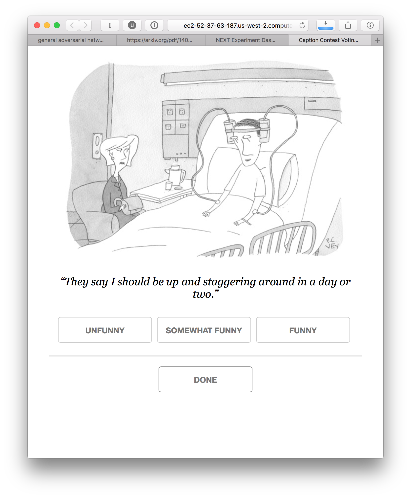

Cardinal bandits (aka "how funny is this caption?")

Histogram of when people responded:

Example query:

This caption contest was also live on the New Yorker caption contest page
(reloading, ads).

This week, for all captions that had at least one duplicate caption, I included a single, exact duplicate of the original caption for comparison purposes. These duplicate captions are listed below:

> * Damn Obamacare!
> * Thanks for popping in
> * Told you so.
> * I feel like my head is about to explode.
> * You should see my catheter.
> * Don't worry it's lite beer.
> * In one ear and out the other.
> * They ran out of IV poles.
> * I'm self-medicating
> * It's a preexisting condition.
> * You should see what they did with the catheter.
> * All ears.
> * Trumpcare.
> * This blood's for you.
> * Did you bring the pretzels?
> * Welcome to TrumpCare.
> * They say it's all in my head
> * It's called drunk care.
> * The doctor went to a party school.
> * It is less filling.
> * Did we win?
> * I know things got a bit out of hand at the office party, but I'm just trying to avoid a hangover.
> * It's happy hour.
> * In one ear, out the other!
> * Sports medicine.
> * Doctor's orders.
> * They ran out of morphine.
> * Did my team win?
> * Don't worry, it's only light beer.
> * Gotta support the team.
> * It's quicker this way
> * The doctors says it's all in your head.
> * It's an IPA IV.
> * Turns out the Doctor is an old fraternity brother.
> * I can hear the ocean.
> * Want a sip?
> * Now can I watch the game?!
> * The counsellor was right about plastic surgery. These implants make me feel fantastic and you look as beautiful to me as the day we first met.
> * The doctor said I needed plenty of fluids.
> * Can you hear me now?
> * The doctor said it's all in my head.
> * I miss Obamacare...
> * Beer?
> * I know what you're thinking.
> * It's Gluten Free
> * I'm type XXX
> * The doctor prescribed The Hair of the Dog!
> * Look mom, no hands
> * Technically, it's no longer a drinking problem.
> * Don't Worry It's LITE.
> * I told you I needed a beer.
> * I cannot hear you.
> * What?!
> * Hair of the Dog
> * My blood type is IPA
> * AHCA.
> * Told you I'd quit drinking.
> * It’s Miller time.
> * Same old, same old: In one ear and out the other.
> * My blood alcohol level is dangerously low.
> * My doctor is a millenial
> * I think.......therefore, I am!
> * Relax, it's light beer.
> * It goes in one ear and out the other.
> * My blood type is Anheuser-Busch.
> * My doctor is an old fraternity brother
> * Make it short. When I touch hands I get NPR in both ears, real loud.
> * It's a Double IPA.
> * Sorry. Doctor's orders.
> * The doctor called it Improvosed Explosive Device syndrome.
