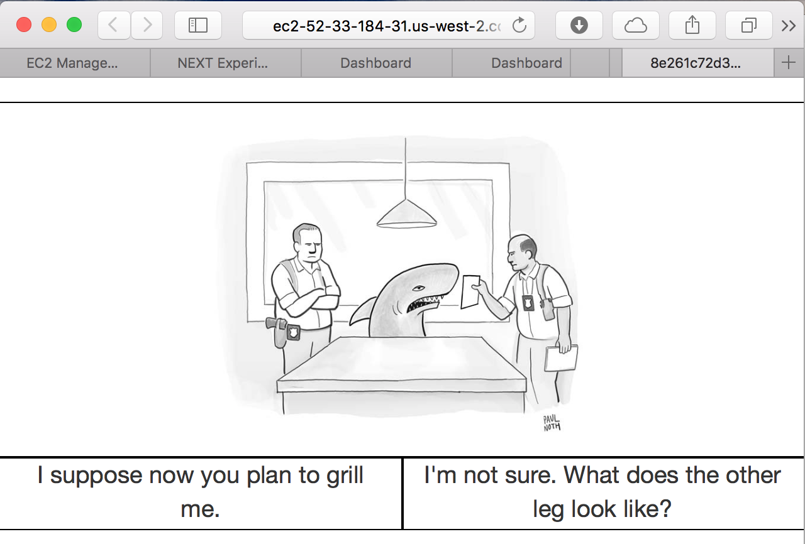

In the `_cardinal` experiments, participants were asked to rate how funny a
caption was as "unfunny", "somewhat funny" or "funny".

In the `_dueling` experiments, participants were asked to choose between the
funniest of two captions.

Round 1 was released with about 6.7k captions. From this, 50 were selected.
With these 50, we created a two part round 2 experiment. We asked the user to

1. Rate how funny each one of the 50 captions were (unfunny, somewhat funny,
   funny)
2. Make unlimited pairwise comparisons.

## Numerics:
### Round 1, cardinal
* Number of participants: 624
* Number of questions answered: 128,391
* Start date: 2016-02-01

*note:* We are currently experiencing a bug with the system responsible for
these captions. While they are not available (as of 2016-2-9) we expect them to
be available shortly.

### Round 2, cardinal
Participants were shown the top 50 captions, each one time.

* Number of participants: 506
* Number of questions answered: 11,182
* Start date: 2016-02-05

### Round 2, dueling
Participants could compare as many caption pairs as they would like.

* Number of participants: 333
* Number of questions answered: 31,966
* Start date: 2016-02-05

## Example queries
### Dueling

### Cardinal

