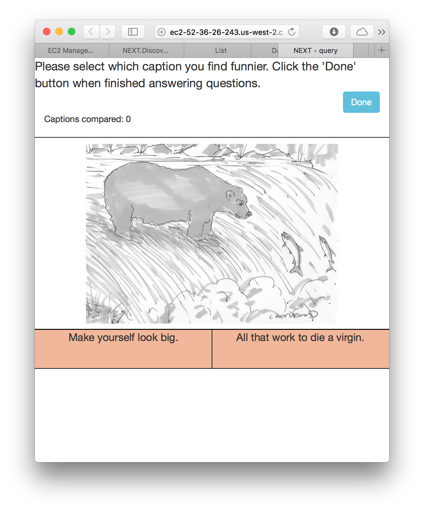

This folder contains data from the New Yorker caption contest. In this contest,
participants are asked to rate different captions. The rating methods varied
among the experiments and more detail is included in the individual folder.

* [497]: This data presented participants with two captions and asked the user
  to choose the funniest caption. It has roughly **23k responses.**
* [499]: This contains the data from an experiment included in a video from
  Robert Mankoff's desk titled "[Cartoon Lounge: Show Me the Funny]". This
  experiment provided the caption "rate the below caption as unfunny, somewhat
  funny or funny." It has roughly **103k responses**.
* [505]: Another cartoon contest. We have roughly **123k responses** for **377
  participants**. This experiment recruited participants through a New Yorker
  mailing list.
* [507]: Roughly **100k** responses for **420 participants**. This experiment
  recruited participants through a New Yorker mailing list.
* [508]: Roughly **163k responses.**

[508]:508/

## Response data
### CSV headers
* **Partipipant ID:** The ID assigned to each participant. Note this is
  assigned when the page is visited; if the same user visits the page twice,
  they will get two participant IDs.
* **Response Time (s):** How long the participant took to respond to the
  question. Network delay is accounted for
* **Network delay (s):** How long the question took to load.
* **Timestamp:** When the query was generated (and not when the query was
  answered)
* **Rating:** What the user rated the caption as. This can be either 1, 2 or 3
  depending on if the joke was unfunny, somewhat funny or funny respectively.
* **Alg label:** The algorithm responsible for showing the query. The random
  sampling is unbiased while "Lil_UCB" adaptively chooses the funniest caption.
* **Target:** The caption the user is asked to rate.

### Datasets provided
* trimmed participant responses, as a CSV (headers included above)
* a trimmed CSV for each collection scheme, as detailed below.
* the full participant response data as a `.json` file. The files to parse this
  file are included in this repo (`json_parse.py`).

### Collection schemes
We decided to generate queries in several ways, either *adaptively* or
randomly. The random data makes no choices based on previous responses on which
queries to ask. The adaptive method does make choices based on previous
responses to decide which queries to ask.

We consider the randomly collected data to be unbiased and the adaptively
collected data to be biased. The randomly collected data is collected under the
"RandomSampling" and "RoundRobin" algorithms while the adaptive schemes are
with the "LilUCB" algorithm.

## Captions
All possible captions to rate. This file is typically called `cap509.txt` or
similar. It contains one caption per line.

## Queries
In earlier experiments, sample queries are also shown (for all experiments
before 509). Other experiments have specified that the experiment setup being
run was either "Cardinal" or "Dueling". In these two experiments, example
captions are below:

| Experiment type         | Example query          |
| :------:                | :-----:                |
|  |  |

The comics are replaced by the file `509.png` (or similar) in the respective
folder and/or in `README.md`.

[499]:499/
[497]:497/
[505]:505/
[507]:507/
[Cartoon Lounge: Show Me the Funny]:http://www.newyorker.com/cartoons/bob-mankoff/cartoon-lounge-show-me-the-funny
